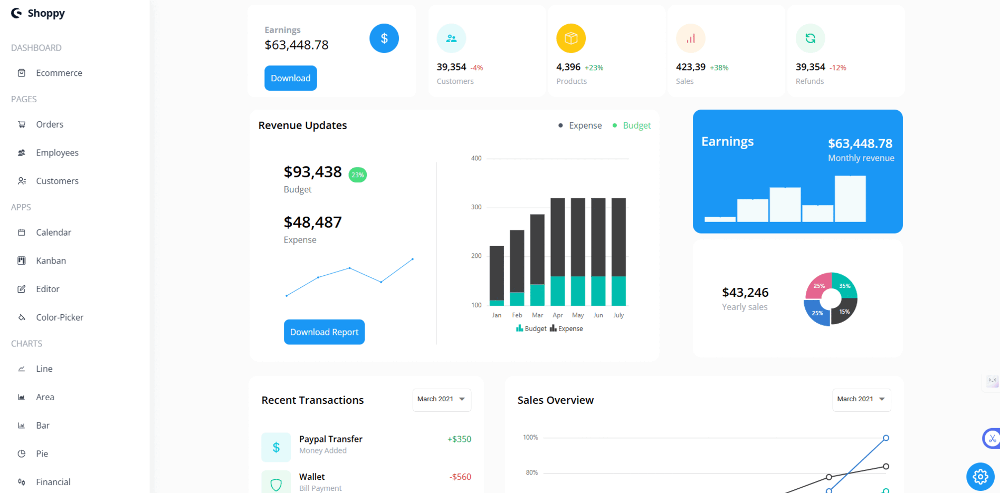

# React Admin Dashboard

A sleek, customizable, and fully responsive Admin Dashboard built using React — designed to make data management smooth, visualization insightful, and user interaction effortless.

## 🚀 Features

- 🎨 **Theming & Customization**
  - Toggle between Light and Dark modes
  - Choose from 6+ vibrant theme colors
  - Dynamic color picker for live personalization

- 📊 **Interactive Data Visualization**
  - Multiple chart types: Line, Area, Bar, Pie, and more
  - Fully responsive and interactive charts with tooltips
  - Professional, clean, and informative data representation

- 🗂️ **Advanced Data Tables**
  - Manage Orders, Employees, and Customers
  - Built-in search, pagination, and editing functionality

- 📅 **Productivity Tools**
  - **Calendar**: Event scheduling with drag-and-drop support
  - **Kanban Board**: Visual task organization (Trello-style)
  - **Rich Text Editor**: Quick content writing and editing
  - **Color Picker**: Instantly adjust dashboard theme

- 📱 **Fully Responsive Design**
  - Looks great on desktops, tablets, and mobile devices

## 🛠️ Tech Stack

- **React.js**
- **React Context API** (State Management)
- **React Router DOM**
- **Syncfusion React Components**
- **CSS3**
- **Netlify** (Deployment)

## ⚡ Quick Start

1. **Clone this repository:**

```bash
git clone https://github.com/your-username/react-admin-dashboard.git
cd react-admin-dashboard
npm install
npm start
```

## Preview


## What Makes This Unique?
Not just another dashboard — this project combines clean UI, powerful functionality, and real productivity features like Kanban boards, calendars, and rich text editing.
Fully customizable, extendable, and production-ready — ready for real-world admin needs.
